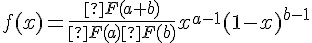
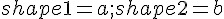

## 貝塔分布 (Beta distribution)

公式：   

Ｒ函數：beta(a, b) 

* 公式： f(x)= Γ(a+b)/(Γ(a)Γ(b))x^(a-1)(1-x)^(b-1)
* 對應：[[  ]]
* 網址：http://stat.ethz.ch/R-manual/R-patched/library/stats/html/Beta.html

R 程式範例

```R
op=par(mfrow=c(2,2))
curve(dbeta(x, 1, 1))
curve(dbeta(x, 1, 5))
curve(dbeta(x, 5, 1))
curve(dbeta(x, 5, 5))
```


