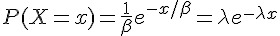
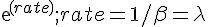
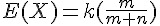
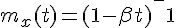

## 指數分布 (Exponential Distribution)

  

* 範圍：x=0,…,k （取出 x 個白球）
* 意義：白球有 m 個，黑球 n 個，取出 k 個球，其中有 x 個白球的機率; (取後不放回)
* R 函數： [[  ]]
 * http://stat.ethz.ch/R-manual/R-patched/library/stats/html/Hypergeometric.html

特性

1.   
2.   


動差生成函數：  


R 程式範例一

```R
op=par(mfrow=c(2,2))
curve(dexp(x, 1), 0, 10)
curve(dexp(x, 5), 0, 10)
curve(dexp(x, 1/5), 0, 10)
curve(dexp(x, 1/2), 0, 10)

```


R 程式範例二

```R
> dexp(1) - exp(-1) #-> 0
[1] 0
```

### 參考文獻
* [Wikipedia:指數分布](http://zh.wikipedia.org/wiki/%E6%8C%87%E6%95%B0%E5%88%86%E5%B8%83)
* [Wikipedia:Hypergeometric_distribution](http://en.wikipedia.org/wiki/Hypergeometric_distribution)

