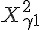
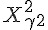
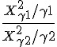
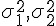

## F 分布 (F distribution)

* 卡方分布    與    互相獨立，則下列算式服從 F 分配。

  

Ｒ函數：F(df1 = n1 and df2 = n2)

* 公式：f(x) = Γ((n1 + n2)/2) / (Γ(n1/2) Γ(n2/2)) (n1/n2)^(n1/2) x^(n1/2 - 1) (1 + (n1/n2) x)^-(n1 + n2)/2
* 網址：http://stat.ethz.ch/R-manual/R-patched/library/stats/html/Fdist.html

特性: 可用來檢定兩組樣本的變異數 [[  ]] 是否相等。

R 程式範例一

```R
op=par(mfrow=c(2,2))
curve(df(x, 1,1), 0, 10)
curve(df(x, 10,1), 0, 10)
curve(df(x, 1,10), 0, 10)
curve(df(x, 10,10), 0, 10)

```


