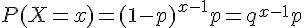
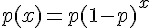
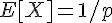
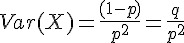
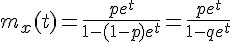

## 幾何分布 (Geometric distribution)

  

範圍：r=1,2,3,.... ; x= r, r+1, r+2, ....

意義：第一次成功所需要的試驗次數。

R 函數： geom(prob) ; p:prob:成功機率, x-1:size:失敗次數, q:失敗機率

* R 的公式：  
* R 當中的 x 代表失敗次數，而非第一次成功的次數，因此 R 當中的 x 相當於上式中的 (x-1)
* <http://stat.ethz.ch/R-manual/R-patched/library/stats/html/Geometric.html>

特性：

1.   
2.   

動差生成函數：  

### 習題

1. 請問丟公平的銅板時，得到第 1 次正面時投擲次數 x 的機率分布為何？該分布的期望值為何？

2. 請問丟公正的骰子時，得到第 1 次 6 點時投擲次數 x 的機率分布為何？該分布的期望值為何？

### R 程式範例：曲線圖

```R
p=0.7; k=seq(0,10)
plot(k, dgeom(k, p), type='h', main='dgeom(p=0.5)', xlab='k')
```
[](../img/dgeomPlot.jpg)

### R 程式範例：

```R
qgeom((1:9)/10, prob = .2)
Ni <- rgeom(20, prob = 1/4); table(factor(Ni, 0:max(Ni)))
```

執行結果：

```R
> qgeom((1:9)/10, prob = .2)
[1]  0  0  1  2  3  4  5  7 10
> Ni <- rgeom(20, prob = 1/4); table(factor(Ni, 0:max(Ni)))

 0  1  2  3  4  5  6  7  8  9 10 11 12 13 14 15 16 17 
 4  5  3  2  0  3  1  0  0  0  1  0  0  0  0  0  0  1 
> 
```

### 參考
* [Wikipedia:幾何分佈](http://zh.wikipedia.org/wiki/%E5%B9%BE%E4%BD%95%E5%88%86%E4%BD%88)
* [Wikipedia:Geometric_distribution](http://en.wikipedia.org/wiki/Geometric_distribution)

