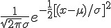
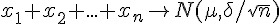
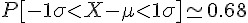
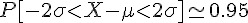
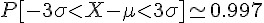

## 常態分布 (Normal Distribution)

意義：有誤差的對稱性分布形式，中央高兩邊低的形式。

繪圖：用 R 繪製標準差為 1, 2, 3, 的常態分布。

```R
curve(dnorm(x), -5, 5, col="black")
curve(dnorm(x, sd=2), -5, 5, col="blue", add=T)
curve(dnorm(x, sd=3), -5, 5, col="green", add=T)
```


R 函數：[norm(mean, sd)](http://stat.ethz.ch/R-manual/R-patched/library/stats/html/Normal.html)

公式：  

R 的公式：f(x) = 1/(√(2 π) σ) e^-((x - μ)^2/(2 σ^2))

重要性：根據中央極限定理，任何 n 個獨立樣本的平均值趨近於常態分布。

中央極限定理：   

### 標準差

1 標準差：    .

2 標準差：    .

3 標準差：    .

```R
> pnorm(1)-pnorm(-1)
[1] 0.6826895
> pnorm(2)-pnorm(-2)
[1] 0.9544997
> pnorm(3)-pnorm(-3)
[1] 0.9973002
> pnorm(4)-pnorm(-4)
[1] 0.9999367
> pnorm(5)-pnorm(-5)
[1] 0.9999994
> pnorm(6)-pnorm(-6)
[1] 1
```

所以現在大家應該知道「工業管理學」上「六標準差」的要求，是很嚴苛的了吧！

### R 程式範例

```R
> dnorm(0)
[1] 0.3989423
> dnorm(0.5)
[1] 0.3520653
> dnorm(2.5)
[1] 0.0175283
> curve(dnorm(x), from = -3.5, to = 3.5, ylab="pdf", main="N(0,1)")
> 
```


```R
> x = rnorm(100)
> hist(x, nclass=8)
> 
```


```R
> x = rnorm(1000)
> hist(x, nclass=50)
> 
```


