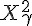
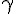
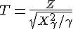
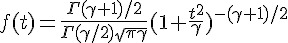
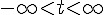
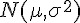
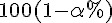
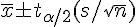

## T 分布 (T distribution)

T 分配：Z 為標準常態分布，   為自由度    的卡方分布。

公式：   

T 分布公式：    ; 範圍：  

圖形：用 R 程式繪製 T 分布的圖形 (與常態分布 Z 比較)

```R
curve(dnorm(x), -5, 5, col="black")
curve(dt(x, df=10), -5, 5, col="green", add=T)
curve(dt(x, df=2), -5, 5, col="red", add=T)
```


Ｒ函數：t(df, Del)

* 公式：T(df=n) := f(x) = Γ((n+1)/2) / (√(n π) Γ(n/2)) (1 + x^2/n)^-((n+1)/2)
* 擴充：T(df, Del) := (U + Del) / √(V/df) ; U ~ N(0,1) , V ~ χ^2(df) 且 (U,V) 獨立。
* 網址：http://stat.ethz.ch/R-manual/R-patched/library/stats/html/TDist.html

用途：可用來描述 n 個常態分布樣本平均值的分布。

描述：令    為一組來自常態分布    的隨機樣本，則下列算式服從自由度 n-1 的 T 分布。

  

估計：當    未知時，   的    信賴區間如下

  

R 程式範例一

```R
op=par(mfrow=c(2,2))
curve(dt(x, 1), -10, 10)
curve(dt(x, 5), -10, 10)
curve(dt(x, 10), -10, 10)
curve(dt(x, 100), -10, 10)

```


