# 期望值與動差生成函數

## 期望值

定義：期望值 E(X) , (通常用符號    代表,  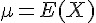 )

> 離散分布：  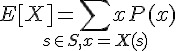   　　　　; 通常簡寫為  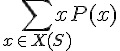  或者直接寫  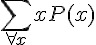 　
> 
> 連續分布：  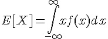 

期望值的相關定理：

> 1.  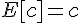  ;
> 
> 2.  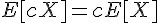  ;
> 
> 3.  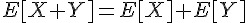  ;

證明

定理 1: E[c] = c

>  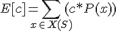  ; 根據期望值定義
> 
>  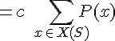   ; 根據基本算術
> 
>  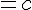                        ; 因為 P(x) 是機率密度函數

定理 2: E[c X] = c E[X]

>  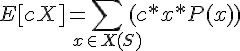   ; 根據期望值定義
> 
>  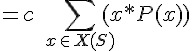   ; 根據基本算術
> 
>  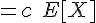                     ; 根據期望值定義

定理 3 : E[X + Y] = E[X] + E[Y]

> 假如離散隨機變數 X, Y 的機率密度函數分別用  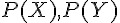  代表。
> 
>  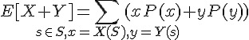   ; 根據期望值定義
> 
>  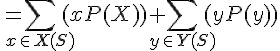  ;  根據乘法對加法的分配率
> 
>  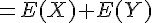  ;

以上證明了離散的情況，連續的情況雷同，請比照上述寫法撰寫。

## 變異數

定義：變異數 Var(X)

> 離散隨機變數 X 的變異數 Var(X) 定義如下
> 
>  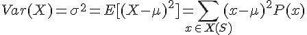 
> 
> 說明：
> 
> 1. 上式中的 Var(X) 稱為 X 的變異數，而其平方根  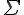  稱為 X 的標準差。 (    為 X 的期望值)
> 2. 以上算式中  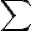  的下標均為  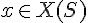 ，而非  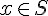 ，也就是 x 是實數值，而非樣本點。
> 3. 這也是為何要將隨機變數定義為實函數的原因，這樣才能對這些「變數」進行 +, -, * > 等代數運算，並且可以進行期望值與變異數的計算。

定理：  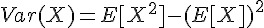  

>  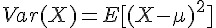  ;
> 
>  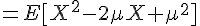  ;
> 
>  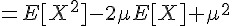  ;
> 
>  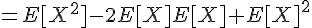  ;
> 
>  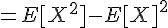  .

## 期望值的函數

有時，我們會想計算某個隨機變數之函數的期望值，像是 E[g(X)]。

某隨機變數 X 之函數 g(X) 的期望值

> *期望值 E[g(X)]：*
> 
>  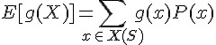 

舉例而言，  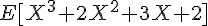  就是一個隨機變數 X 的函數  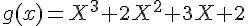  的期望值。

而且、由於上述定理 1, 2, 3 的特性，這些期望值的函數還可以拆開來算，舉例如下：

>    ;
> 
>  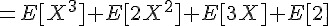  ;
> 
>  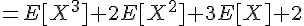  .

在以上的範例中，  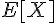  稱為 X 的 1 級動差，  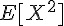  稱為 X 的 2 級動差，  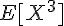  稱為 X 的 3 級動差 ....

## k 階動差 (Kth Ordinary Moment)

> 定義：  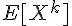  稱為隨機變數 X 的 k 階動差 (Kth ordinary moment)

動差的慨念就像是期望值的多項式，我們可以將任何一個多項式的動差寫成 k 個動差的組合，這樣就能將任何的函數的動差給支解。

但是、可惜的是，即使我們將函數分解成動差的組合，其計算上仍然是相當複雜的，但是如果我們只是想變任某個期望值函數對應的原始機率分布為何，那麼可以藉助「動差生成函數」來完成這項任務，以下是動差生成函數的定義。

## 動差生成函數

> 定義：隨機變數 X 的動差生成函數 (Moment Generating Function, m.g.f)  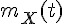  為以下函數
> 
>  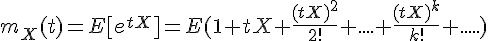 
> 
> 動差存在的條件是期望值  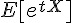  在開區間 (-h, h) 內是有限的。

根據以上定義，離散分布與連續分布的動差生成函數分別可以寫成以下算式：

> 離散分布：  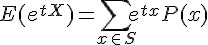 
> 
> 連續分布：  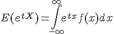 

那麼、動差生成函數到底有甚麼用呢？

關於這個問題，可以讓我們回到泰勒展開式這個微積分的概念來看，就能理解「動差生成函數」背後的原理了。

根據泰勒展開式，我們可以將函數    展開如下：

 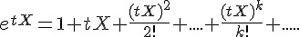 

您可以看到在上述展開式當中，不管 k 為何，每一項的  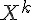  都存在，並不會消失，而且    的係數為  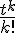  ，
因此、只要在某個夠小的開區間 (-h, h) 內這個動差生成函數是有限的，那麼隨機變數  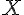  與函數    之間將會有對映關係，而機率密度函數 P(X) 與動差生成函數  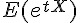  也可以被證明有一對一的對映關係。

於是、動差生成函數就成了一個機率分布的「指紋」，意思是如果兩個隨機變數 X, Y 的動差生成函數  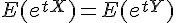  ，則這兩個機率分布也必然相同。

思考 1：

> 思考：為何動差生成函數可以做為一個機率分布的「指紋」呢？
> 
> 說明：如果兩個機率分布 P(X) 與 P(Y) 的動差生成函數相同，那麼將意味著  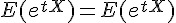  ，根據泰勒展開式可得到
> 
>   
> 
> 因此在每一階的動差上，    都與    相同，因此這兩個分布也就應該是一樣的了。

回顧 1：

> f(x) 在 0 點的泰勒展開式 (麥克羅林級數) 可以作為一個函數的指紋，意思是如果兩個函數的泰勒展開式相同，則這兩個函數必然相同 (這點是高等微積分課程的核心)。

回顧 2：

> 函數 f(x) 的特徵函數 (Characteristic function) 為   

## 結語

為何數學家要將隨機變數定義成一種函數，然後相樣本映射到實數空間上，而不是直接對樣本進行機率運算呢？筆者認為應該是為了期望值而布的局，因為將樣本映射到實數之後，才能用下列算式計算期望值。

>   

而隨機變數之間的代數運算，像是 「3X」 , 「X+Y」 , 「X-2Y」 ,「`X*Y`」, 「`X*X*X*X`」等 運算的結果，也仍然是一種作用在樣本空間 S 的實函數，只是當 X, Y 兩者的樣本空間有所不同時，我們必須以兩者樣本空間的迪卡兒乘積    作為樣本空間。

在這種情況下，期望值函數也才能運作在 +, - * 等運算空間中，得到以下的廣義期望值：

>   

「動差生成函數」可以做為機率分布的指紋，因此如果兩個機率分布的「動差生成函數」相同，那麼其機率分布也會相同。

「動差生成函數」的定義如下：

>   
